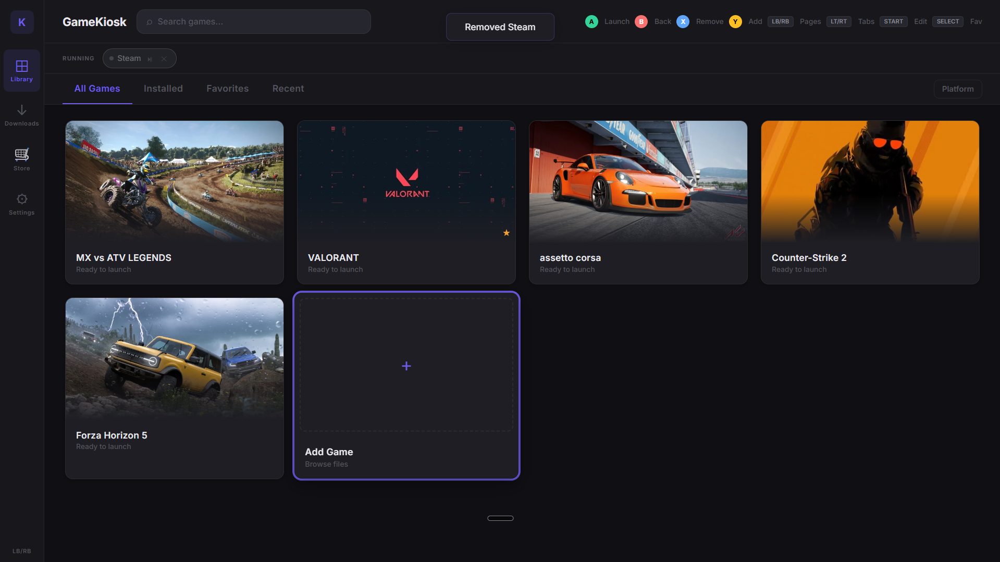

# GameKiosk

A modern, controller-friendly game launcher for Windows. Built with Tauri, React, and Rust.



## Features

- **Full Controller Support** - Navigate entirely with gamepad (Xbox, PlayStation, etc.)
- **Game Library Management** - Add games, shortcuts, or any executable
- **IGDB Integration** - Automatic game cover art and metadata from IGDB database
- **Multi-Game Switching** - Run multiple games simultaneously, switch between them instantly
- **Audio Management** - Automatically mutes background games when switching
- **Floating Action Button** - Transparent overlay icon to return to launcher while gaming
- **Keyboard Shortcuts** - `Ctrl+Shift+G`, `Home/Guide`, or `Select/Back` on controller to return to launcher
- **Fullscreen Kiosk Mode** - Designed for TV/couch gaming setups
- **Dark Theme** - Easy on the eyes for gaming sessions
- **Downloads Browser** - Quick access to your Downloads folder for installing new games

## Screenshots

| Main Library 
|----------------------------|
|  

## Installation

### Download Release

Download the latest installer from [Releases](https://github.com/yourusername/GameKiosk/releases).

### Build from Source

Prerequisites:
- [Node.js](https://nodejs.org/) (v18+)
- [Rust](https://rustup.rs/)
- [Tauri CLI](https://tauri.app/v1/guides/getting-started/prerequisites)

```bash
# Clone the repository
git clone https://github.com/yourusername/GameKiosk.git
cd GameKiosk

# Install dependencies
npm install

# Run in development mode
npm run tauri dev

# Build for production
npm run tauri build
```

## Usage

### Adding Games

1. Click the **+** button or press **Y** on controller
2. Browse to your game executable (.exe, .lnk, or .url)
3. GameKiosk will automatically search for cover art

### Controller Navigation

| Button | Action |
|--------|--------|
| D-Pad / Left Stick | Navigate |
| A | Select / Launch |
| B | Back / Cancel |
| X | Edit game |
| Y | Add new game |
| LB / RB | Switch tabs |
| Home / Guide | Return to GameKiosk |
| Select / Back | Return to GameKiosk (fallback if Guide is captured) |

### Keyboard Shortcuts

| Shortcut | Action |
|----------|--------|
| `Ctrl+Shift+G` | Return to GameKiosk from any game |
| `Arrow Keys` | Navigate |
| `Enter` | Select / Launch |
| `Escape` | Back / Cancel |

### IGDB Setup (Optional)

For automatic game cover art:

1. Go to [dev.twitch.tv/console](https://dev.twitch.tv/console)
2. Register a new application
3. Copy your Client ID and Client Secret
4. Paste them in GameKiosk Settings

## Tech Stack

- **Frontend**: React 19, TypeScript, Vite
- **Backend**: Rust, Tauri 2
- **Gamepad**: gilrs (Rust gamepad library)
- **API**: IGDB for game metadata

## Contributing

Contributions are welcome! Please feel free to submit a Pull Request.

1. Fork the repository
2. Create your feature branch (`git checkout -b feature/amazing-feature`)
3. Commit your changes (`git commit -m 'Add amazing feature'`)
4. Push to the branch (`git push origin feature/amazing-feature`)
5. Open a Pull Request

## License

This project is licensed under the MIT License - see the [LICENSE](LICENSE) file for details.

## Acknowledgments

- [Tauri](https://tauri.app/) - Desktop app framework
- [IGDB](https://www.igdb.com/) - Game database API
- [gilrs](https://gitlab.com/gilrs-project/gilrs) - Gamepad input library
